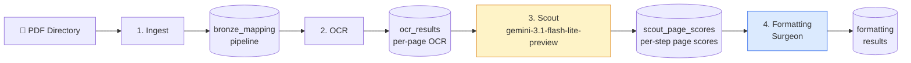
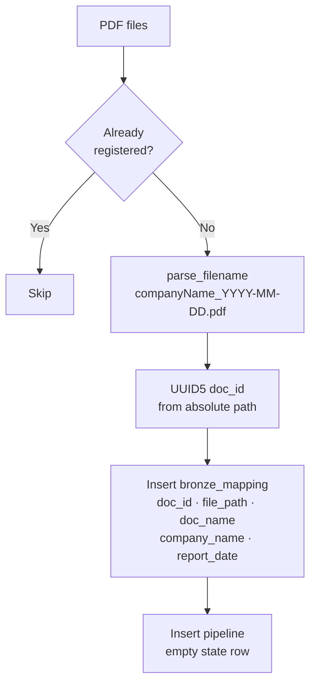
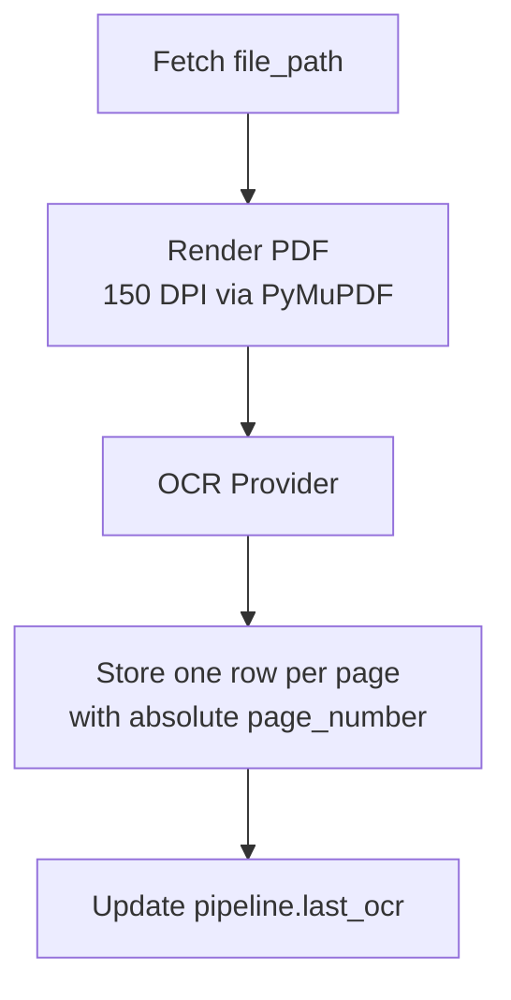
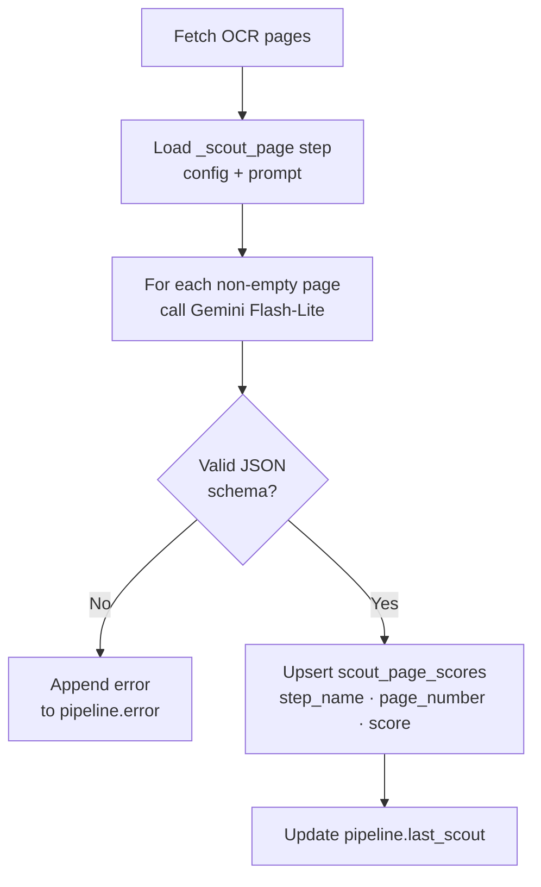
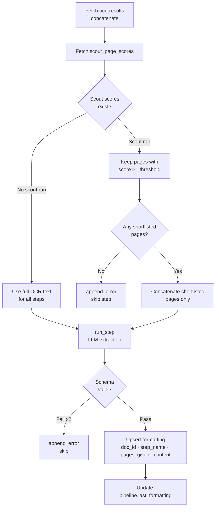
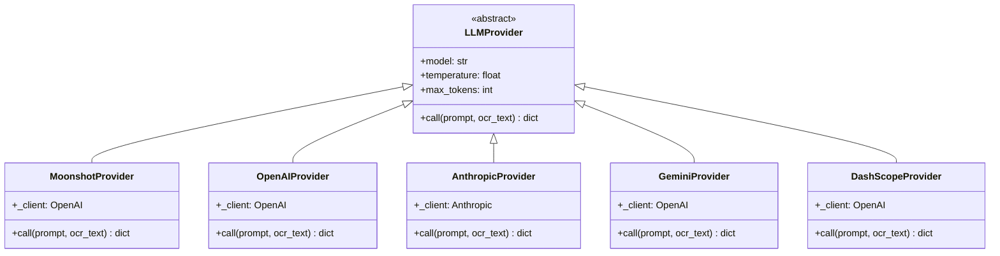
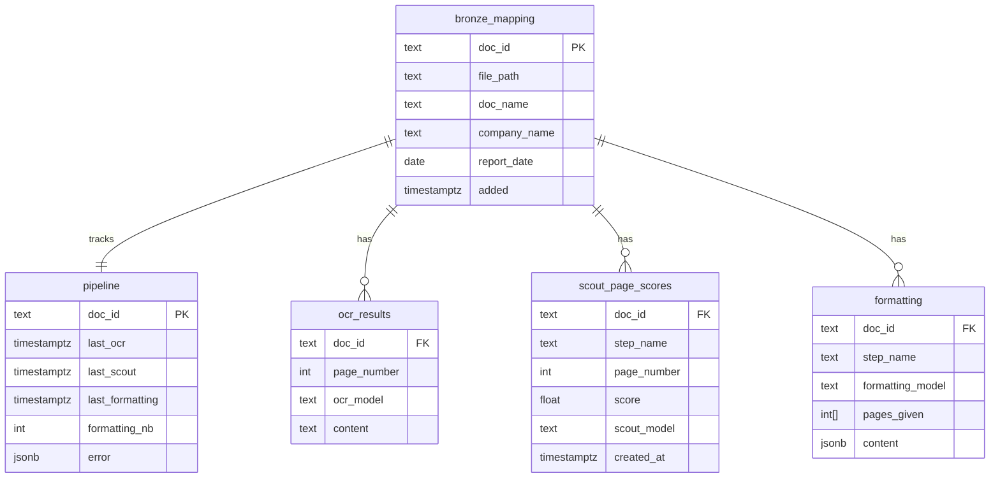
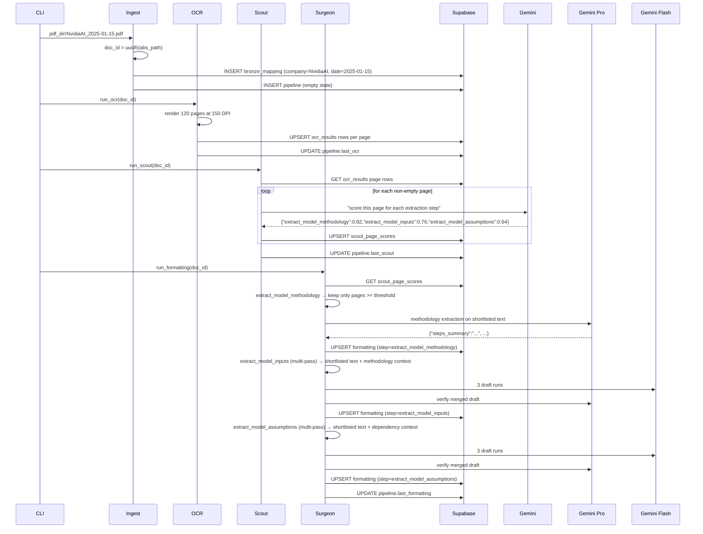

# Financial Reports OCR Ingestion Pipeline

A three-layer (Bronze / Silver / Gold) idempotent PDF ingestion pipeline for financial reports.
## Overview

This pipeline transforms raw PDF research reports into structured, queryable data stored in Supabase. It follows a **four-stage architecture**: Ingest → OCR → Scout → Formatting (Surgeon). The Scout–Surgeon pattern is the core design: a cheap model first identifies *which pages* contain relevant content, then an expensive model processes only those targeted pages — saving cost and improving extraction quality.

---

## Pipeline Stages



Each stage is independently re-runnable via `--step <name>`. Stages write to Supabase and are idempotent: they skip already-processed documents unless `--parse-all` or `--parse-date` is specified.

---

## Stage 1 — Ingest

**Input:** Directory of PDF files
**Output:** Rows in `bronze_mapping` and `pipeline`



**Key detail:** `doc_id` is a UUID5 derived from the absolute file path — deterministic and collision-free across re-runs. Filename format `<Company>_<YYYY-MM-DD>.pdf` is parsed to extract `company_name` and `report_date`.

---

## Stage 2 — OCR

**Input:** `bronze_mapping.file_path`
**Output:** Rows in `ocr_results` (one per page)



**Critical design:** every OCR row is page-addressable and includes an absolute page marker (`--- Page 76 ---`, not `--- Page 1 ---`). This lets Scout score and Formatting select individual pages without reconstructing page ranges.

### OCR Providers

| Provider | Key | Notes |
|----------|-----|-------|
| `zai` (default) | `ZAI_API_KEY` | ZAI cloud layout-parsing API (`glm-ocr`) |
| `local` | — | HuggingFace `zai-org/GLM-OCR`, runs on-device |

Selected via `OCR_PROVIDER` env var.

---

## Stage 3 — Scout

**Input:** OCR text page by page
**Output:** Rows in `scout_page_scores` (one per active step per page)
**Model:** `gemini-3.1-flash-lite-preview` via Google's OpenAI-compatible endpoint



**Scout output format:**
```json
{
  "extract_model_methodology": 0.91,
  "extract_model_inputs": 0.84,
  "extract_model_assumptions": 0.79
}
```

Each page gets one score per active step. Formatting keeps only pages at or above `SCOUT_SCORE_THRESHOLD`.

---

## Stage 4 — Formatting (Surgeon)

**Input:** OCR text + scout page scores
**Output:** Rows in `formatting` (one per active step), including the structured `content` and the exact `pages_given` to the model



**Page selection:** formatting concatenates only shortlisted pages for a step. If scout ran and no page clears the threshold, that step is skipped rather than falling back to the full document.

---

## Active Steps

`ACTIVE_STEPS` in `config.py` currently enables:

- `extract_model_methodology`
- `extract_model_inputs`
- `extract_model_assumptions`

### Model usage by stage

| Stage | Step | Provider | Model(s) | Calls per document | Model input |
|------|------|----------|----------|--------------------|-------------|
| OCR | `ocr` with `OCR_PROVIDER=zai` (default) | ZAI | `glm-ocr` | `ceil(total_pages / 75)` calls for full OCR (plus optional re-OCR batches for empty pages) | **Pages only** (PDF bytes) |
| OCR | `ocr` with `OCR_PROVIDER=local` | HuggingFace local | `zai-org/GLM-OCR` | `1` call per page | **Pages only** (rendered page image) |
| Scout | `_scout_page` | gemini | `gemini-3.1-flash-lite-preview` | `1` call per non-empty OCR page (retry once on schema/key mismatch, so up to `2 * non_empty_pages`) | **Text only** (one page of OCR text at a time) |
| Formatting | `extract_model_methodology` | gemini | `gemini-3.1-pro-preview` | `1` call normally (up to `2` with schema-retry) | **Text only** (concatenated shortlisted OCR page text) |
| Formatting (multi-pass) | `extract_model_inputs` | gemini | drafts: `gemini-2.0-flash` (3 runs), verify: `gemini-3.1-pro-preview` | Typical: `4` calls (`3` draft + `1` verify). Worst case with verify retry: `5` calls. If all drafts fail, fallback is single-pass pro (`1-2` calls). | **Text only** (shortlisted OCR text + methodology context text) |
| Formatting (multi-pass) | `extract_model_assumptions` | gemini | drafts: `gemini-2.0-flash` (3 runs), verify: `gemini-3.1-pro-preview` | Typical: `4` calls (`3` draft + `1` verify). Worst case with verify retry: `5` calls. If all drafts fail, fallback is single-pass pro (`1-2` calls). | **Text only** (shortlisted OCR text + methodology/inputs context text) |

`pages_given` persisted in the `formatting` table records exactly which page numbers were provided to each formatting step.

Steps are defined under `steps/<step_name>/` with three files: `config.json`, `schema.json`, `prompt.txt`. Company-specific prompts can be placed in `steps/<step_name>/prompts/<CompanyName>.txt`.
Each extraction step `config.json` should also include a `definition` field used by `_scout_page` to score page relevance.

---

## LLM Provider Architecture



All providers implement the same `call(prompt, ocr_text) → dict` interface. Gemini, Moonshot, and DashScope all use the OpenAI SDK pointed at a custom `base_url`.

---

## Database Schema



---

## Data Flow: End-to-End Example

A 120-page report `NvidiaAI_2025-01-15.pdf` moving through the pipeline:



---

## CLI Reference

```bash
# Full pipeline (all 4 steps)
uv run python main.py /path/to/pdfs

# Single step
uv run python main.py /path/to/pdfs --step scout

# Multiple steps
uv run python main.py /path/to/pdfs --step ocr --step scout

# Force re-process all documents
uv run python main.py /path/to/pdfs --parse-all

# Re-process documents added on or after a date
uv run python main.py /path/to/pdfs --parse-date 2025-01-01
```

---

## Adding a New Extraction Step

1. Create `steps/<step_name>/` with three files:

```
steps/my_step/
├── config.json      # {"definition": "...", "provider": "moonshot", "model": "kimi-k2.5", "temperature": 0, "max_tokens": 2048}
├── schema.json      # JSON Schema for the expected output
└── prompt.txt       # Prompt with {ocr_text} placeholder
```

2. Add `"my_step"` to `ACTIVE_STEPS` in `config.py`

3. Add a `definition` in `steps/<step_name>/config.json`; scout reads this field for relevance scoring automatically.

That's it — the scout will automatically find the relevant pages, and the surgeon will run your step on the filtered text.

## What it does

1. **Bronze — Ingest** registers PDF files in Supabase with a stable, deterministic ID (UUID5 of the absolute file path). Running it twice on the same file is a no-op.
2. **Silver — OCR** renders each PDF page to an image and runs it through [GLM-OCR](https://huggingface.co/zai-org/GLM-OCR) to extract raw text. Results are stored per-page.
3. **Silver — Scout** scores each OCR-successful page for each extraction step and persists those page-level relevance scores.
4. **Gold — Formatting** takes only the shortlisted OCR pages for each step and runs extraction prompts with Gemini models (single-pass and multi-pass depending on step config).

Pipeline state is tracked in Supabase PostgreSQL so every stage is resumable and idempotent.

To enable the new scout flow, apply [schema_changes.sql](/Users/arthurm/Documents/School/AIDAMS/bocconi/research_assistant/ingestion_pipeline_reports/schema_changes.sql) in Supabase before running the pipeline.

---

## Architecture

```
ingestion_pipeline_reports/
├── main.py               CLI entry point (click)
├── config.py             Constants: model IDs, active steps, paths
├── pipeline/
│   ├── tracker.py        Supabase DB helpers
│   ├── ingest.py         Bronze layer — register PDFs
│   ├── ocr.py            Silver layer — page-level GLM-OCR extraction
│   ├── scout.py          Silver layer — page-level relevance scoring
│   └── formatting.py     Gold layer — structured output extraction
└── steps/
    ├── _scout_page/
    ├── extract_model_methodology/
    ├── extract_model_inputs/
    └── extract_model_assumptions/
```

### Database schema (Supabase PostgreSQL)

| Table | Layer | Description |
|-------|-------|-------------|
| `bronze_mapping` | Bronze | Append-only registry of ingested PDFs (no deletes enforced via trigger) |
| `pipeline` | Silver | Per-document processing state (`last_ocr`, `last_scout`, `last_formatting`, `error`) |
| `ocr_results` | Silver | OCR text per document page |
| `scout_page_scores` | Silver | Relevance score per document, step, and page |
| `formatting` | Gold | Structured JSON output per document per step, plus the exact pages passed to the model |

---

## CLI

```
uv run python main.py PDF_DIR [OPTIONS]
```

| Argument / Option | Description |
|---|---|
| `PDF_DIR` | Directory containing `.pdf` files to ingest |
| `--parse-all` | Force re-run of OCR and formatting on all documents |
| `--parse-date YYYY-MM-DD` | Re-run only documents ingested on or after this date |

### Examples

```bash
# First run — ingest and process all PDFs in ./reports/
uv run python main.py ./reports/

# Re-process everything
uv run python main.py ./reports/ --parse-all

# Re-process documents added since June 2024
uv run python main.py ./reports/ --parse-date 2024-06-01
```

---

## Adding new formatting steps

1. Create `steps/<step_name>/` with `prompt.txt`, `schema.json`, and `config.json`.
   - Use `{ocr_text}` as the placeholder for OCR content.
   - The prompt must instruct the model to return a JSON object.
   - Add a `definition` string in `config.json`; scout uses it as the page-level relevance description for that step.
2. Register the step in `config.py`:
   ```python
   ACTIVE_STEPS = ["extract_model_methodology", "extract_model_inputs", "extract_model_assumptions", "<step_name>"]
   ```
3. Results appear in the `formatting` table under `step_name = "<step_name>"`.

---

## Running tests

```bash
uv run pytest tests/ -v
```

The test suite covers tracker, ingest, OCR, scout, formatting, and CLI behavior.
