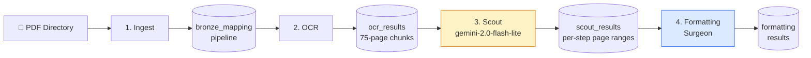
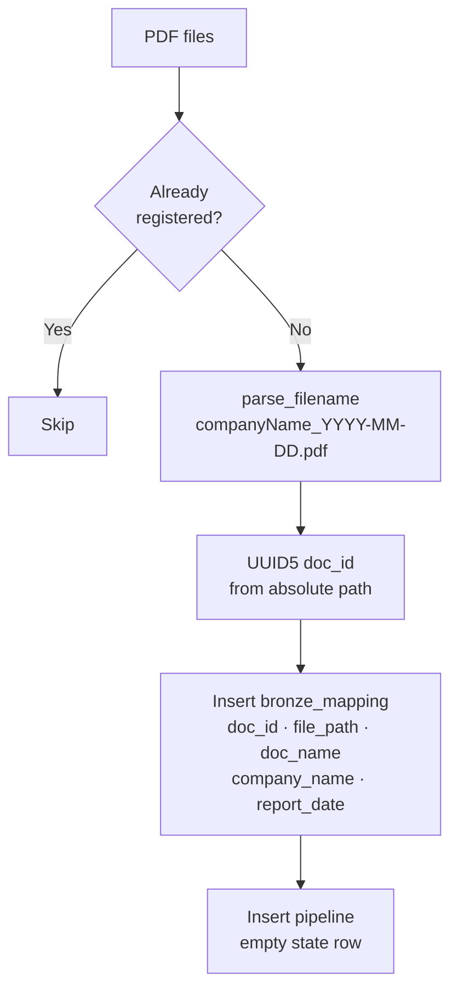
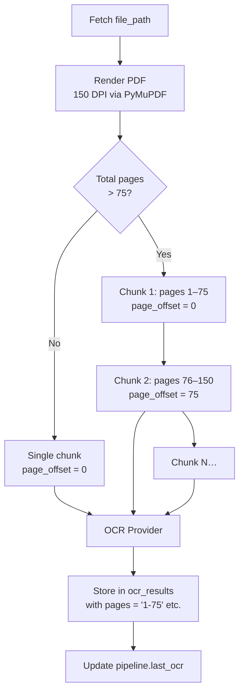
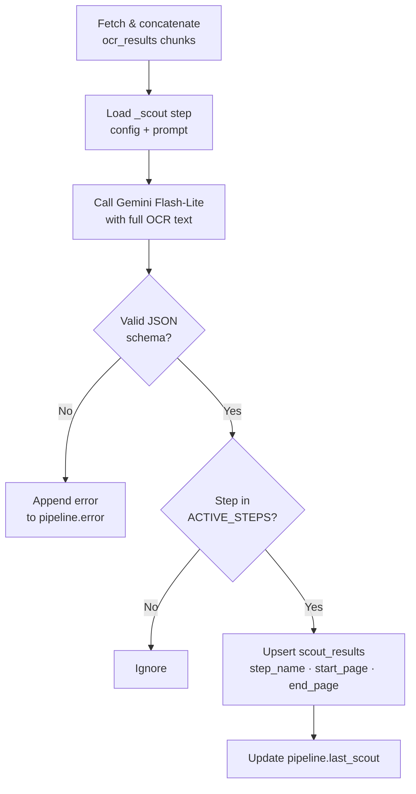
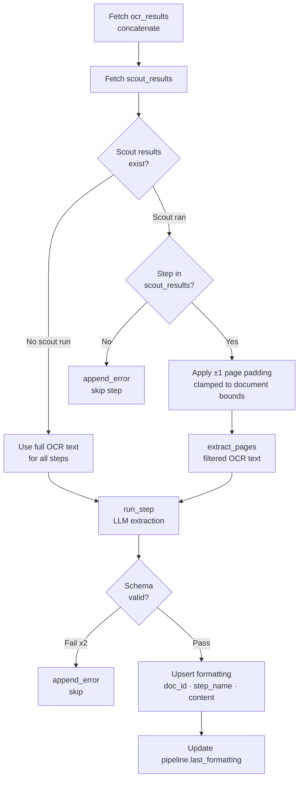
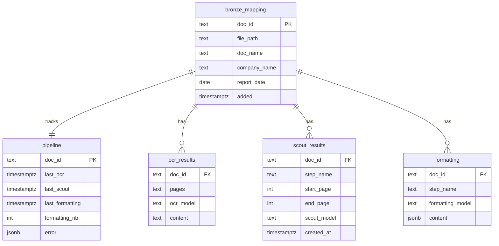
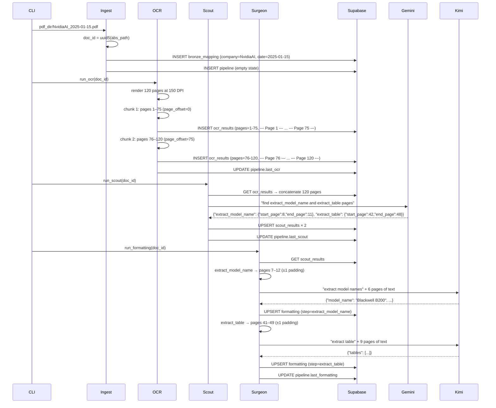

# Financial Reports OCR Ingestion Pipeline

A three-layer (Bronze / Silver / Gold) idempotent PDF ingestion pipeline for financial reports.
## Overview

This pipeline transforms raw PDF research reports into structured, queryable data stored in Supabase. It follows a **four-stage architecture**: Ingest → OCR → Scout → Formatting (Surgeon). The Scout–Surgeon pattern is the core design: a cheap model first identifies *which pages* contain relevant content, then an expensive model processes only those targeted pages — saving cost and improving extraction quality.

---

## Pipeline Stages



Each stage is independently re-runnable via `--step <name>`. Stages write to Supabase and are idempotent: they skip already-processed documents unless `--parse-all` or `--parse-date` is specified.

---

## Stage 1 — Ingest

**Input:** Directory of PDF files
**Output:** Rows in `bronze_mapping` and `pipeline`



**Key detail:** `doc_id` is a UUID5 derived from the absolute file path — deterministic and collision-free across re-runs. Filename format `<Company>_<YYYY-MM-DD>.pdf` is parsed to extract `company_name` and `report_date`.

---

## Stage 2 — OCR

**Input:** `bronze_mapping.file_path`
**Output:** Rows in `ocr_results` (one per 75-page chunk)



**Critical design:** Each chunk receives a `page_offset` so every page marker in the output is an **absolute** page number (`--- Page 76 ---`, not `--- Page 1 ---`). This enables the Scout to return meaningful global page ranges.

### OCR Providers

| Provider | Key | Notes |
|----------|-----|-------|
| `local` (default) | — | HuggingFace `zai-org/GLM-OCR`, runs on-device |
| `zai` | `ZAI_API_KEY` | ZAI cloud layout-parsing API |

Selected via `OCR_PROVIDER` env var.

---

## Stage 3 — Scout

**Input:** Concatenated OCR text (all chunks)
**Output:** Rows in `scout_results` (one per active step)
**Model:** `gemini-2.0-flash-lite` via Google's OpenAI-compatible endpoint



**Scout output format:**
```json
{
  "extract_model_name": { "start_page": 5, "end_page": 8 },
  "extract_table":      { "start_page": 12, "end_page": 15 }
}
```

The Scout stores raw page ranges. Padding (`SCOUT_PAGE_PADDING = 1`) is applied in the next stage.

---

## Stage 4 — Formatting (Surgeon)

**Input:** OCR text + scout page ranges
**Output:** Rows in `formatting` (one per active step)



**Page extraction:** `extract_pages(ocr_text, start, end)` splits on `--- Page N ---` markers and returns only sections within the requested range. This means the surgeon model receives a focused context — often 3–5 pages instead of 100+.

---

## Active Steps

| Step | Provider | Model | Max Tokens | Purpose |
|------|----------|-------|-----------|---------|
| `extract_model_name` | moonshot | kimi-k2.5 | 1024 | Extract AI model names and specs |
| `extract_table` | moonshot | kimi-k2.5 | 4096 | Extract performance/benchmark tables |
| `_scout` | gemini | gemini-2.0-flash-lite | 2048 | Identify relevant page ranges |

Steps are defined under `steps/<step_name>/` with three files: `config.json`, `schema.json`, `prompt.txt`. Company-specific prompts can be placed in `steps/<step_name>/prompts/<CompanyName>.txt`.

---

## LLM Provider Architecture


All providers implement the same `call(prompt, ocr_text) → dict` interface. Gemini, Moonshot, and DashScope all use the OpenAI SDK pointed at a custom `base_url`.

---

## Database Schema



---

## Data Flow: End-to-End Example

A 120-page report `NvidiaAI_2025-01-15.pdf` moving through the pipeline:



---

## CLI Reference

```bash
# Full pipeline (all 4 steps)
uv run python main.py /path/to/pdfs

# Single step
uv run python main.py /path/to/pdfs --step scout

# Multiple steps
uv run python main.py /path/to/pdfs --step ocr --step scout

# Force re-process all documents
uv run python main.py /path/to/pdfs --parse-all

# Re-process documents added on or after a date
uv run python main.py /path/to/pdfs --parse-date 2025-01-01
```

---

## Adding a New Extraction Step

1. Create `steps/<step_name>/` with three files:

```
steps/my_step/
├── config.json      # {"provider": "moonshot", "model": "kimi-k2.5", "temperature": 0, "max_tokens": 2048}
├── schema.json      # JSON Schema for the expected output
└── prompt.txt       # Prompt with {ocr_text} placeholder
```

2. Add `"my_step"` to `ACTIVE_STEPS` in `config.py`

3. Update `steps/_scout/prompt.txt` to describe what pages the scout should look for

That's it — the scout will automatically find the relevant pages, and the surgeon will run your step on the filtered text.

## What it does

1. **Bronze — Ingest** registers PDF files in Supabase with a stable, deterministic ID (UUID5 of the absolute file path). Running it twice on the same file is a no-op.
2. **Silver — OCR** renders each PDF page to an image and runs it through [GLM-OCR](https://huggingface.co/zai-org/GLM-OCR) to extract raw text. Results are stored per-document.
3. **Gold — Formatting** takes the OCR text and runs a sequence of LLM prompts (Kimi K2.5 via Moonshot API) to produce structured JSON outputs, one per step (e.g. model name extraction, table extraction).

Pipeline state is tracked in Supabase PostgreSQL so every stage is resumable and idempotent.

---

## Architecture

```
ingestion_pipeline_reports/
├── main.py               CLI entry point (click)
├── config.py             Constants: model IDs, active steps, paths
├── pipeline/
│   ├── tracker.py        Supabase DB helpers
│   ├── ingest.py         Bronze layer — register PDFs
│   ├── ocr.py            Silver layer — GLM-OCR extraction
│   └── formatting.py     Gold layer — Kimi K2.5 structured output
└── prompts/
    ├── extract_model_name.txt
    └── extract_table.txt
```

### Database schema (Supabase PostgreSQL)

| Table | Layer | Description |
|-------|-------|-------------|
| `bronze_mapping` | Bronze | Append-only registry of ingested PDFs (no deletes enforced via trigger) |
| `pipeline` | Silver | Per-document processing state (`last_ocr`, `last_formatting`, `error`) |
| `ocr_results` | Silver | Full OCR text per document |
| `formatting` | Gold | Structured JSON output per document per step |

---

## CLI

```
uv run python main.py PDF_DIR [OPTIONS]
```

| Argument / Option | Description |
|---|---|
| `PDF_DIR` | Directory containing `.pdf` files to ingest |
| `--parse-all` | Force re-run of OCR and formatting on all documents |
| `--parse-date YYYY-MM-DD` | Re-run only documents ingested on or after this date |

### Examples

```bash
# First run — ingest and process all PDFs in ./reports/
uv run python main.py ./reports/

# Re-process everything
uv run python main.py ./reports/ --parse-all

# Re-process documents added since June 2024
uv run python main.py ./reports/ --parse-date 2024-06-01
```

---

## Adding new formatting steps

1. Add a prompt file: `prompts/<step_name>.txt`
   - Use `{ocr_text}` as the placeholder for OCR content.
   - The prompt must instruct the model to return a JSON object.
2. Register the step in `config.py`:
   ```python
   ACTIVE_STEPS = ["extract_model_name", "extract_table", "<step_name>"]
   ```
3. Results appear in the `formatting` table under `step_name = "<step_name>"`.

---

## Running tests

```bash
uv run pytest tests/ -v
```

48 tests cover all layers: tracker, ingest, OCR, formatting, and CLI.
